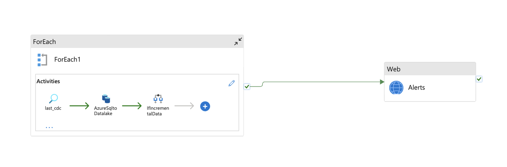
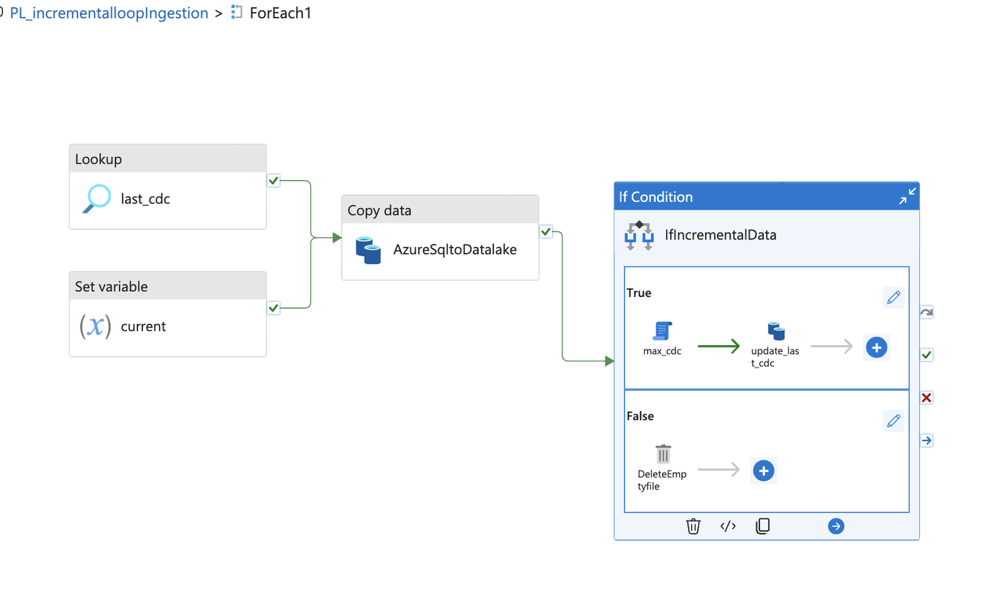
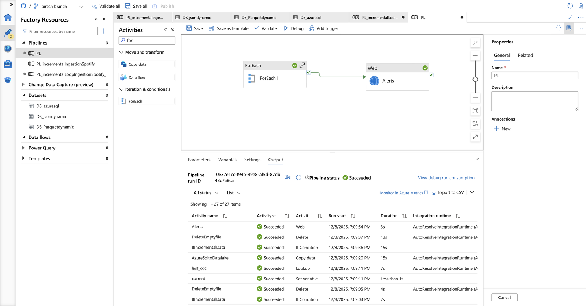
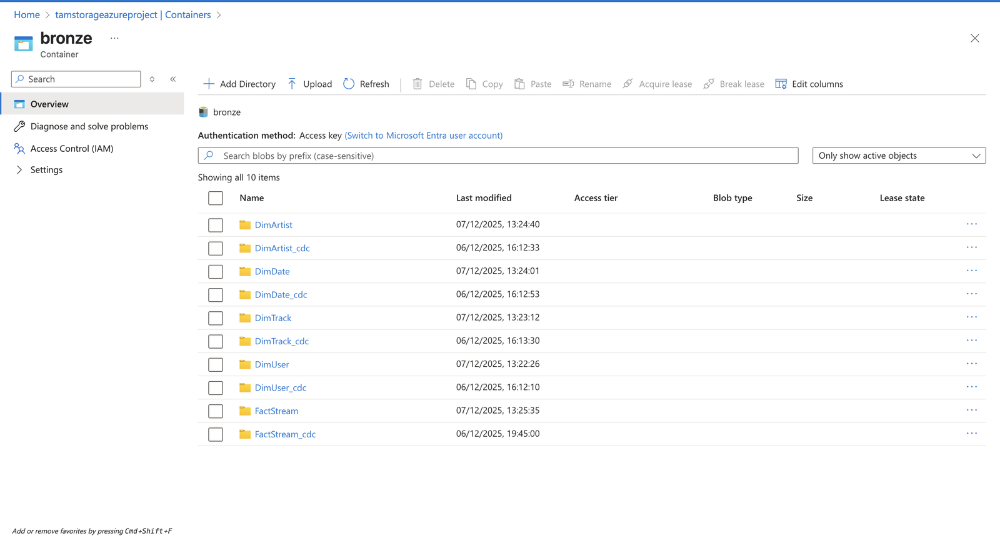
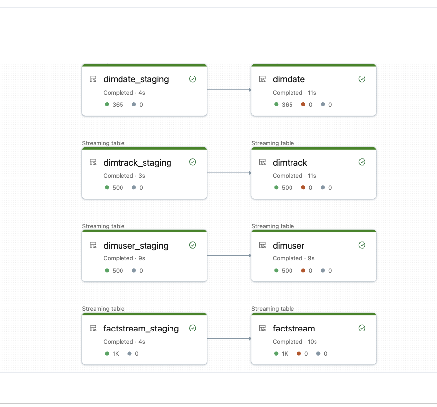
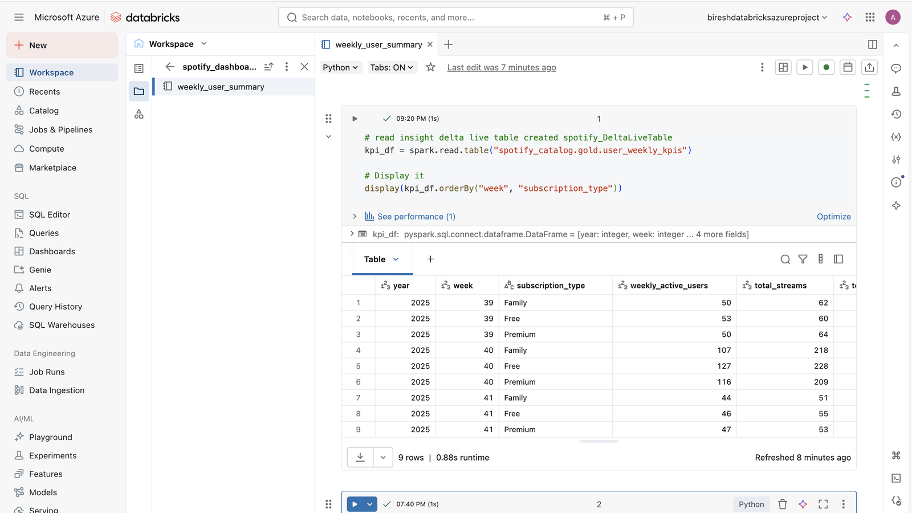
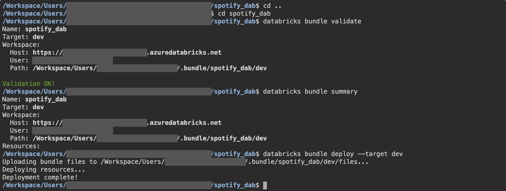
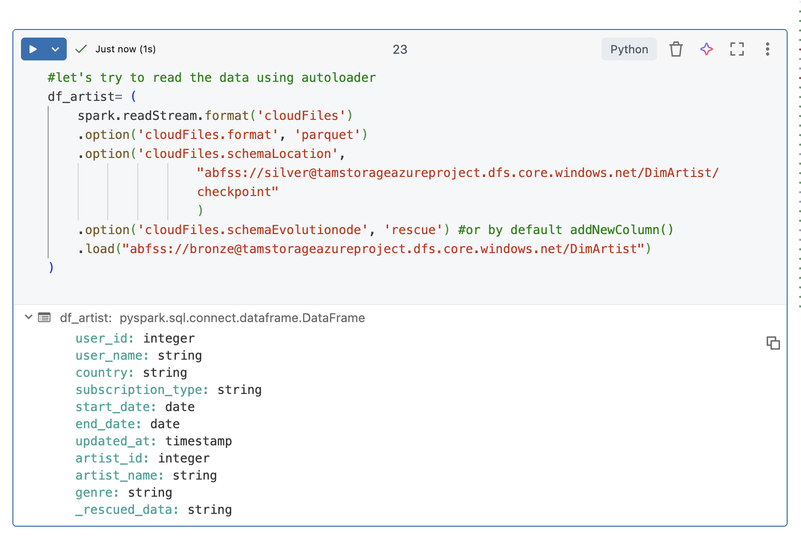

# Spotify Analytics Pipeline — Azure Data Factory + Databricks

End-to-end batch pipeline on Azure: an Azure SQL source is loaded incrementally into
ADLS Gen2 by Azure Data Factory, then refined through a medallion architecture in
Azure Databricks (Auto Loader → Silver, Lakeflow Declarative Pipelines → Gold) and
served as KPI tables and dashboards.

> Built by following a guided Azure data engineering course, then extended and debugged
> on my own. The [Issues I solved](#issues-i-solved) section is the part I'd most like
> to talk about. My larger, independently designed project is
> [databricks-lakehouse-platform](https://github.com/111BM/databricks-lakehouse-platform).

## Architecture

```
Azure SQL Database (DimUser, DimTrack, DimArtist, DimDate, FactStream)
        │  ADF: metadata-driven ForEach loop, watermark-based incremental copy
        ▼
ADLS Gen2  bronze/   raw Parquet, one folder per table
        │  Databricks Auto Loader (cloudFiles) + dedup + cleaning
        ▼
ADLS Gen2  silver/   Delta tables registered in Unity Catalog (spotify_catalog.silver)
        │  Lakeflow Declarative Pipeline (DLT) with expectations
        ▼
spotify_catalog.gold
   ├── dimensions: dim_user, dim_artist, dim_track, dim_date (SCD Type 2 via AUTO CDC)
   ├── facts:      fact_stream (SCD Type 1 upsert via AUTO CDC)
   └── insights:   user_weekly_kpis, top_tracks_per_country,
                   most_streamed_tracks_per_week, average_listen_duration_per_device
        ▼
Databricks dashboards
```

## Repository layout

| Path | What it is |
|---|---|
| `adf/` | Azure Data Factory JSON (Git-integrated export): pipelines, datasets, linked services |
| `adf/loop_input.json` | Table metadata driving the ForEach loop (schema, table, CDC column) |
| `sql/` | Source seed data for Azure SQL: initial load and an incremental batch |
| `databricks/` | Databricks Asset Bundle `spotify_dab` (dev and prod targets) |
| `databricks/src/silver/` | Auto Loader ingestion Bronze → Silver |
| `databricks/src/gold/spotify_DeltaLiveTable/` | DLT dimensions, facts and KPI tables |
| `databricks/Jinja/` | Metadata-driven SQL generation with Jinja templates |
| `databricks/utils/` | Reusable transformation helpers |

## 1. Ingestion — Azure Data Factory (Azure SQL → Bronze)

`PL_incrementalloopIngestion` loops over the tables in `loop_input` (ForEach, sequential):

1. **Lookup** `last_cdc` — reads the table's watermark JSON from ADLS.
2. **Set variable** `current` — run timestamp.
3. **Copy** — selects rows where `cdc_col > last_cdc` into `bronze/<table>/` as Parquet.
4. **If condition** on rows copied:
   - *true* → **Script** `max_cdc` gets the new high-water mark, **Copy** `update_last_cdc` writes it back;
   - *false* → **Delete** the empty file the copy activity leaves behind (the copy always
     writes a file, so empty loads are cleaned up rather than skipped).
5. **Web activity** posts to a Logic App that sends an email when the loop succeeds.

The watermark only moves after a successful copy, so a failed run is re-run safely from
the previous watermark. A `from_date` in `loop_input` allows a backfill.





A run where every activity succeeded (`DeleteEmptyfile` runs for tables with no new rows):



Bronze holds one data folder and one `_cdc` watermark folder per table:



## 2. Silver — Databricks Auto Loader

- Unity Catalog metastore, access connector, storage credential and external locations
  for `bronze`, `silver`, `gold`.
- `silver_Dimensions.py` reads each Bronze folder with Auto Loader (`cloudFiles`, Parquet),
  with a **separate schema / checkpoint location per table**, deduplicates and cleans, and
  writes Delta to `silver/<table>/data` while registering `spotify_catalog.silver.<table>`.
- Jinja notebook builds the fact-to-dimension join SQL from a parameter list instead of
  hand-writing each query.

## 3. Gold — Lakeflow Declarative Pipelines

- Staging views read Silver as streams and apply **expectations** (`expect_all_or_drop`),
  e.g. `user_id IS NOT NULL`.
- All four dimensions are **SCD Type 2** using `create_auto_cdc_flow` (e.g. `dim_user` keyed on
  `user_id`, sequenced by `updated_at`); `fact_stream` uses AUTO CDC as an SCD Type 1 upsert.
- Insight tables aggregate business KPIs for dashboards.



`user_weekly_kpis` read back from `spotify_catalog.gold` for the dashboard:



## Deployment

The Databricks code is a Databricks Asset Bundle with `dev` (development mode) and
`prod` (production mode, shared root path) targets:

```bash
cd databricks
databricks bundle validate -t dev
databricks bundle deploy -t dev
```

Validating and deploying the bundle to the dev target (workspace user and host redacted):



Set the workspace host in `databricks.yml` and replace `<your-user>` placeholders first.
ADF artifacts can be imported by connecting a Data Factory to this repo with `adf/` as
the root folder. Replace `<LOGIC_APP_HTTP_TRIGGER_URL>` with your own Logic App trigger.

## Issues I solved

**1. Columns from one table leaking into another (Auto Loader schema).**
After reading `DimArtist`, the schema included `user_id`, `user_name`, `subscription_type`
from `DimUser`. Cause: the same checkpoint / schema location had been reused, and Auto
Loader merges newly inferred schemas with the one stored in `_schemas`. Fix: one
schema location and checkpoint per table, then clear the polluted checkpoint and Silver
folder and re-ingest. Lesson: the checkpoint *is* Auto Loader's memory.



**2. KPI table built with 0 rows and no error.**
`user_weekly_kpis` filtered `stream_timestamp >= current_date() - 28`, but the source data
was older than 28 days, so every row was filtered out silently. Fix: aggregate over the
data's own time range (year / ISO week) instead of the wall clock. Lesson: avoid
`current_date()` in Gold logic unless the data is genuinely real-time — backfills and
replays break it.

**3. "DLT module is not supported on this cluster."**
DLT code was being run on an all-purpose cluster. It only runs inside a pipeline, which
provisions its own compute; interactive clusters are for testing plain Spark logic.

## What I'd do next

- Unit tests for the transformation helpers and CI that runs `bundle validate` on every PR.
- Switch ADF linked services from SQL auth / account key to managed identity + Key Vault.
- Handle source deletes (`apply_as_deletes`) and add expectations to `dim_track`, `dim_date` and the fact.
- Alert on failure too: the Logic App call currently runs only when the loop succeeds.

## Tech

Azure SQL Database · Azure Data Factory · ADLS Gen2 · Logic Apps · Azure Databricks ·
Unity Catalog · Auto Loader · Lakeflow Declarative Pipelines (DLT) · Databricks Asset
Bundles · PySpark · Jinja
